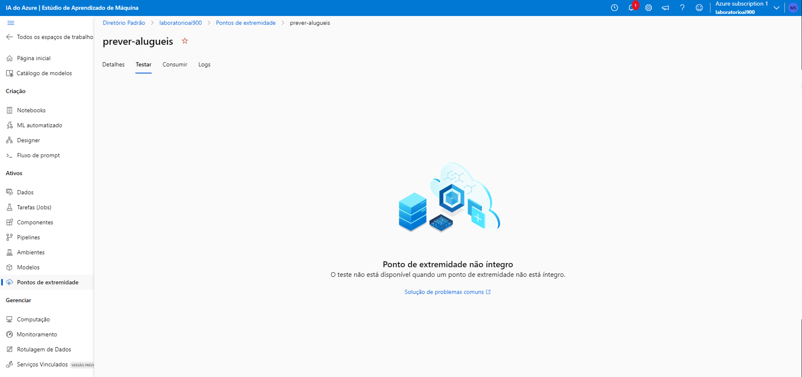
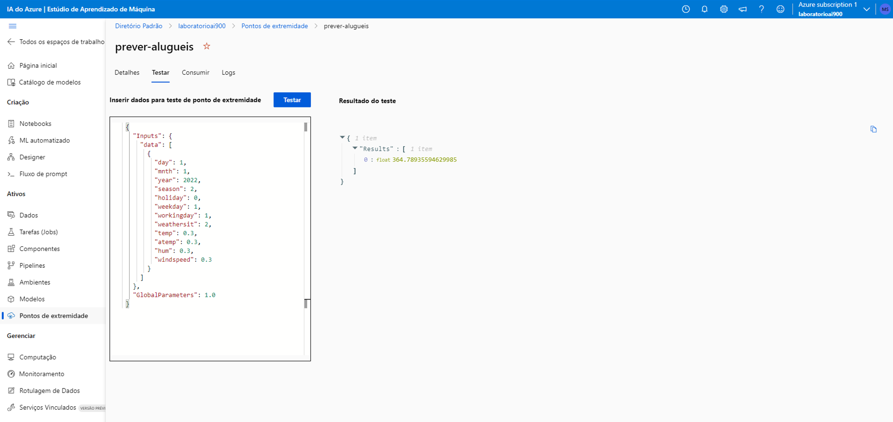

# Modelo de previsão utilizando Azure ML

Ultilizando o Azure Machine Learning para treinar um modelo para prever a quantidade de alugueis de bicicletas em um determinado dia levando em consideração características sazonais e meteorológicas com base em dados históricos de aluguel de bicicletas.


## Passo a passo
### Criando um espaço de trabalho do Azure Machine Learning

1- Entre na página inicial do [Azure](https://portal.azure.com/#home).  
2- Selecione a opção **Criar um recurso**.  
3- Pesquise por **Machine Learning** e selecione a opção **Azure Machine Learning**.  
4-  Selecione **Criar**.  
5-  Configure da seguinte maneira:  
- **Assinatura**: sua assinatura Azure
- **Grupo de recurso**: LABAI-900
- **Nome**: laboratorioai900
- **Região**: East US

6-  O resto deixe como está e selecione **Examinar e criar** logo em seguida **Criar** e aguarde a implantação ser concluida.  
7-  Após ser concluida selecione **Ir para o recurso**, depois em **Iniciar estúdio**.  

### Usando aprendizado de máquina automatizado para treinar um modelo
1-  Irá abrir uma nova aba do navegador e nas opções no canto esquerdo selecione **ML automatizado**.  
2-  Crie um **Novo trabalho de ML automatizado** com as seguintes configurações:

**Configurações básicas**:

- **Nome do trabalho**: mslearn-bike-automl
- **Novo nome do experimento**: mslearn-bike-rental
- **Descrição**: Aprendizado de máquina automatizado para previsão de aluguel de bicicletas
- **Marcas**: nenhum

**Tipo de tarefa e dados**:
- **Selecione o tipo de tarefa**: Regressão
- **Selecionar conjunto de dados**: crie um novo conjunto de dados com as seguintes configurações:

    **Tipo de dados**:
    - **Nome**: aluguel de bicicletas
    - **Descrição**: dados históricos de aluguel de bicicletas
    - **Tipo**: Tabular

    **Fonte de dados**:
    - Selecione **De arquivos da Web**  

    **URL da Web**:
    - **URL da Web**: https://aka.ms/bike-rentals
    - **Ignorar validação de dados**: não selecionar

    **Configurações**:
    - **Formato de arquivo**: Delimitado
    - **Delimitador**: Vírgula
    - **Codificação**: UTF-8
    - **Cabeçalhos de coluna**: apenas o primeiro arquivo possui cabeçalhos
    - **Pular linhas**: Nenhum
    - **O conjunto de dados contém dados multilinhas**: não selecione

    **Esquema**: 
    - Incluir todas as colunas exceto **Caminho**
    - Revise os tipos detectados automaticamente
    
    Selecione **Criar**. Após a criação do conjunto de dados, selecione o conjunto de dados de **aluguel de bicicletas** para continuar a enviar o trabalho de ML automatizado.

**Configurações de tarefas**:

- **Tipo de tarefa**: Regressão
- **Conjunto de dados**: aluguel de bicicletas
- **Coluna de destino**: rentals(Integer)

    **Configurações adicionais**:
    - **Métrica primária**: Normalized root mean squared error
    - **Explicar o melhor modelo**: Não selecionado
    - **Usar todos os modelos suportados**: Desmarcado
- Modelos permitidos : Selecione apenas **RandomForest** e **LightGBM**

    **Limites**: expanda esta seção
    - **Máximo de avaliações**: 3
    - **Máximo de avaliações simultâneas**: 3
    - **Máximo de nós**: 3
    - **Limite de pontuação da métrica**: 0,085 ( para que, se um modelo atingir uma pontuação da métrica de erro quadrático médio normalizado de 0,085 ou menos, o trabalho termina.)
    - **Tempo limite do experimento**: 15
    - **Tempo limite de iteração**: 15
    - **Habilitar encerramento antecipado**: selecionado

    **Validação e testar**:
    - **Tipo de validação**: Divisão de validação de treinamento
    - **Porcentagem de dados de validação**: 10
    - **Conjunto de dados de teste**: Nenhum

**Computação**:

- **Selecione o tipo de computação**: sem servidor
- **Tipo de máquina virtual**: CPU
- **Camada de máquina virtual**: Dedicada
- **Tamanho da máquina virtual**: Standard_DS3_V2*
- **Número de instâncias**: 1

Envie o trabalho de treinamento. Ele inicia automaticamente. Espere o trabalho terminar. Pode demorar um pouco.

### Avaliando o melhor modelo

Quando o trabalho automatizado de aprendizado de máquina for concluído, você poderá revisar o melhor modelo treinado.

1- Na guia **Visão geral** do trabalho automatizado de aprendizado de máquina, observe o melhor resumo de modelo.  

imagem

2- Selecione o texto em **Nome do algoritmo** do melhor modelo para visualizar seus detalhes.

3- Selecione a guia **Métricas** e selecione os gráficos **residuals** e **predicted_true** se eles ainda não estiverem selecionados.

Revise os gráficos que mostram o desempenho do modelo. O gráfico de resíduos mostra os resíduos (as diferenças entre os valores previstos e reais) como um histograma. O gráfico predito_true compara os valores previstos com os valores verdadeiros.

### Implantando e testando o modelo

1- Na guia **Visão geral** do trabalho automatizado de aprendizado de máquina, observe o melhor resumo de modelo.  
2- Selecione o texto em **Nome do algoritmo** do melhor modelo para visualizar seus detalhes.  
3- Selecione **Modelo**, depois **Implantar** em seguida **Serviço Web**

**Implantar um modelo**
- **Nome**: prever-alugueis
- **Descrição**: Prever aluguel de bicicletas
- **Tipo de computação**: Instância de Contêiner do Azure
- **Habilitar autenticação**: selecionado
- Selecione o botão **Implantar**

4- Aguarde a implantação ser concluida.  
5- Ao ser concluida selecione **Pontos de extremidade** no menu esquerdo e depois **prever-alugueis**.  
6- Selecione **Testar**. Em um primeiro momento apareceu o seguinte erro:



7- Depois de alguns minutos o erro desapareceu:

i

8- Podendo assim o teste ser realizado, copie e cole o seguinte código JSON:

```JSON
{
   "Inputs": { 
     "data": [
       {
         "day": 1,
         "mnth": 1,   
         "year": 2022,
         "season": 2,
         "holiday": 0,
         "weekday": 1,
         "workingday": 1,
         "weathersit": 2, 
         "temp": 0.3, 
         "atemp": 0.3,
         "hum": 0.3,
         "windspeed": 0.3 
       }
     ]    
   },   
   "GlobalParameters": 1.0
 }
```
9- Selecione **Testar**
- O painel de teste pegou os dados de entrada e usou o modelo treinado para retorna o número previsto de aluguéis de bicicletas:


## Referência

 - [Microsoft Learn](https://microsoftlearning.github.io/mslearn-ai-fundamentals/Instructions/Labs/01-machine-learning.html)

